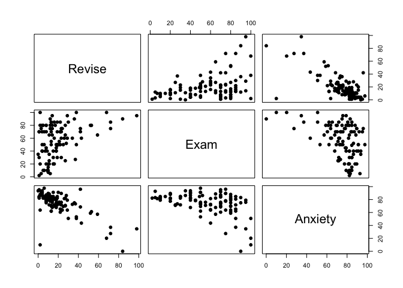
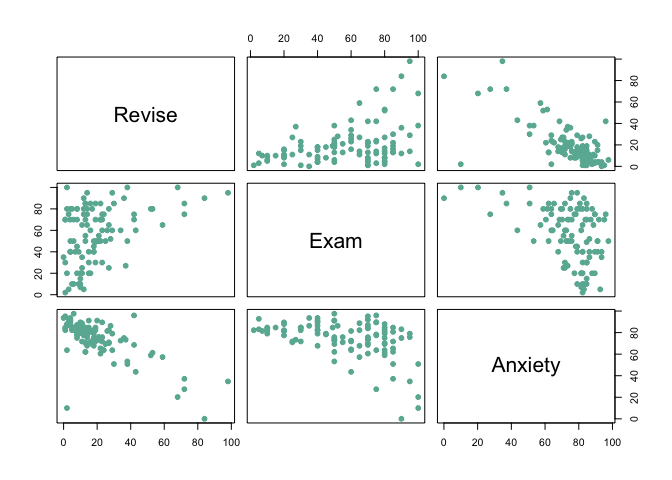

``` r
data=rio::import("Exam Anxiety.sav")
```

``` r
jmv::corrMatrix(
    data = data,
    vars = vars(Revise, Exam, Anxiety),
    flag = TRUE,
    n = TRUE,
    ci = TRUE,
    plots = TRUE,
    plotDens = TRUE,
    plotStats = TRUE)
```

    ## 
    ##  CORRELATION MATRIX
    ## 
    ##  Correlation Matrix                                                   
    ##  ──────────────────────────────────────────────────────────────────── 
    ##                               Revise        Exam          Anxiety     
    ##  ──────────────────────────────────────────────────────────────────── 
    ##    Revise     Pearson's r              —                              
    ##               p-value                  —                              
    ##               95% CI Upper             —                              
    ##               95% CI Lower             —                              
    ##               N                        —                              
    ##                                                                       
    ##    Exam       Pearson's r      0.3967207             —                
    ##               p-value          0.0000334             —                
    ##               95% CI Upper     0.5481602             —                
    ##               95% CI Lower     0.2200938             —                
    ##               N                      103             —                
    ##                                                                       
    ##    Anxiety    Pearson's r     -0.7092493    -0.4409934            —   
    ##               p-value         < .0000001     0.0000031            —   
    ##               95% CI Upper    -0.5977733    -0.2705591            —   
    ##               95% CI Lower    -0.7938168    -0.5846244            —   
    ##               N                      103           103            —   
    ##  ──────────────────────────────────────────────────────────────────── 
    ##    Note. * p < .05, ** p < .01, *** p < .001


Correlation
===========

Create a scatterplot matrix
---------------------------

I couldn’t see how to create a scatterplot matrix in Jamovi right away
so I found some R functions. The code is below.

``` r
# The pairs and plots functions are part of baseR

# pairs using column numbers
pairs(data[,2:4], pch = 19)

# pairs using formula format
pairs(~Revise + Exam + Anxiety, data=data, pch = 19)
```



``` r
# Plot
plot(data[ , 2:4] , pch=20 , cex=1.5 , col="#69b3a2")
```



``` r
# the ggpairs function is part of GGally package which expands ggplot2 package

library(ggplot2)
```

    ## Warning: package 'ggplot2' was built under R version 4.0.2

``` r
library(GGally)
```

    ## Warning: package 'GGally' was built under R version 4.0.2

``` r
# ggpairs using column numbers
GGally::ggpairs(data,columns=2:4)
```


``` r
# ggpairs using column names
GGally::ggpairs(data,columns=c('Revise','Exam','Anxiety'),lower = list(continuous = "smooth"))
```


